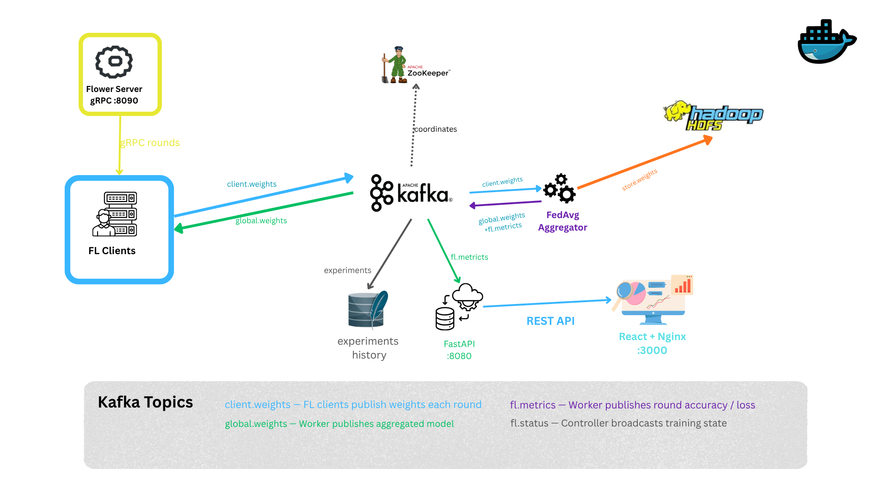

<div align="center">

# SpamFL — Federated Learning for Email Spam Detection

**Privacy-preserving email classification across distributed clients**
*Raw email text never leaves the device. Only DP-noised model weights are shared.*

[](https://python.org)
[](https://pytorch.org)
[](https://flower.ai)
[](https://kafka.apache.org)
[](https://hadoop.apache.org)
[](https://fastapi.tiangolo.com)
[](https://react.dev)
[](https://typescriptlang.org)
[](https://docker.com)

</div>

---

## What is SpamFL?

SpamFL is a **production-structured Horizontal Federated Learning** system where multiple independent clients collaboratively train a shared spam detection model — without ever exposing their private email data. Each client trains locally; only **differentially-private model weights** travel over the network.

The system is event-driven: services communicate exclusively through **Apache Kafka** topics. A dedicated **Worker** service consumes weights, performs **FedAvg aggregation**, persists weight snapshots to **HDFS**, and publishes the global model back. A **FastAPI** controller orchestrates the full lifecycle. A **React dashboard** provides real-time monitoring, email classification simulation, and experiment tracking.

---

## Architecture



> All services run in Docker containers. Kafka is the sole communication bus — services never call each other directly.

### Data Flow — One Federated Round



### Service Map

| Service | Technology | Port | Role |
|---|---|---|---|
| **Dashboard** | React + Nginx | `3000` / `5173` (dev) | Control UI + monitoring |
| **Controller API** | FastAPI + asyncio | `8080` | Orchestration + inference |
| **Flower Server** | flwr gRPC | `8090` | Round coordination |
| **FL Clients** | PyTorch + flwr | — | Local training + DP noise |
| **Worker** | Python + Kafka | — | FedAvg aggregation + HDFS storage |
| **Apache Kafka** | Confluent 7.5 | `9092` | Event bus (4 topics) |
| **Apache HDFS** | bde2020 | `9870` (UI) | Weight snapshot storage |
| **ZooKeeper** | Confluent 7.5 | `2181` | Kafka coordination |
| **Kafka UI** | Provectus | `8090` (prod) | Topic browser |
| **SQLite** | — | — | Experiment history |

---

## Key Features

- **Horizontal Federated Learning** — FedAvg and FedProx algorithms, configurable from the dashboard
- **Differential Privacy** — Per-round L2 gradient clipping + Gaussian noise before weight publication
- **Event-Driven Architecture** — Kafka decouples all services; any service can be replaced or scaled independently
- **HDFS Weight Persistence** — Every client's weights per round are stored at `/fl/weights/round_N/client.npz`, enabling full audit and replay
- **Non-IID Data** — Three client profiles (marketing / balanced / phishing) with genuinely different spam distributions
- **Live Dashboard** — SSE-powered real-time convergence charts, confusion matrix, per-client accuracy, round timeline
- **Experiment Tracker** — Full history of training runs with side-by-side comparison and PDF export
- **Email Simulation** — Compose or auto-generate an email, classify it, and inspect the 20-feature breakdown
- **JWT Authentication** — All API routes protected; dashboard handles login/token lifecycle automatically
- **ONNX Export** — Download any client's model as ONNX for deployment

---

## Tech Stack

| Layer | Technology | Why |
|---|---|---|
| **FL Framework** | [Flower (flwr)](https://flower.ai) | Handles gRPC round coordination and client selection; we plug in our own Kafka-backed aggregation |
| **ML** | PyTorch 2.0 | `state_dict()` makes weight extraction trivial; dynamic graph eases debugging |
| **Model** | TabularMLP `[20→128→64→2]` | LayerNorm (not BatchNorm — BatchNorm running stats corrupt FedAvg averaging) |
| **Event Bus** | Apache Kafka | Durable log, replayable, zero coupling between services |
| **Storage** | Apache HDFS | Designed for large binary blobs; path to MapReduce FedAvg at scale |
| **API** | FastAPI + asyncio | Async-native; handles SSE streams, Kafka consumers, and HTTP concurrently |
| **Database** | SQLite | Zero-ops experiment history; swap for Postgres with no API changes |
| **Frontend** | React 19 + TypeScript + Vite | Type-safe; Recharts for charts; SSE for live updates |
| **Styling** | Tailwind CSS | Utility-first; consistent dark theme |
| **Proxy** | Nginx | Serves SPA, proxies `/api/*` to controller, passes SSE through with `proxy_buffering off` |
| **Infra** | Docker + Docker Compose | Reproducible environment; healthcheck-gated startup order |
| **Privacy** | NumPy DP | Clip + Gaussian noise; `clip_norm` and `noise_mult` configurable per training run |

---

## Project Structure

```
pfa-fl/
├── docker-compose.yml              # Full stack orchestration
├── .env.example                    # ACCESS_CODE + JWT_SECRET template
│
├── controller/                     # FastAPI orchestration API (:8080)
│   ├── app/
│   │   ├── main.py                 # App factory + AuthMiddleware
│   │   ├── routes/
│   │   │   ├── auth.py             # JWT login endpoint
│   │   │   ├── clients.py          # CRUD for FL participants
│   │   │   ├── data.py             # Dataset generation + stats
│   │   │   ├── training.py         # Start/stop/status + SSE stream
│   │   │   └── inference.py        # classify + batch CSV + ONNX export
│   │   └── services/
│   │       ├── classifier.py       # 20-feature extraction + inference
│   │       └── flower.py           # Flower subprocess management
│   ├── Dockerfile
│   └── requirements.txt
│
├── fl/
│   ├── shared/                     # Shared by all FL services
│   │   ├── model.py                # TabularMLP — single source of truth
│   │   ├── features.py             # 20-feature email extractor
│   │   ├── schemas.py              # Kafka message dataclasses + base64 serialisation
│   │   └── kafka_utils.py          # Producer/consumer factory helpers
│   │
│   ├── server/                     # Flower server
│   │   ├── main.py
│   │   ├── strategy.py             # FedAvg / FedProx strategy
│   │   └── metrics.py              # Round metrics + confusion matrix
│   │
│   ├── client/                     # Flower client (one process per participant)
│   │   ├── main.py                 # NumPyClient + Kafka publisher
│   │   ├── trainer.py              # Local training + TP/FP/TN/FN eval
│   │   ├── privacy.py              # DP: clip + Gaussian noise
│   │   ├── data.py                 # CSV loader + StandardScaler
│   │   └── finetune.py             # Post-federation personalisation
│   │
│   ├── data/{client-id}/           # Per-client private datasets (never shared)
│   │   ├── dataset.csv
│   │   └── model.pt                # Personalised model post-distribution
│   │
│   └── output/                     # Global model + training artefacts
│       ├── global_model.pt
│       ├── best_model.pt
│       ├── metrics.json
│       └── logs.jsonl
│
├── worker/                         # Kafka consumer + HDFS + FedAvg
│   ├── main.py
│   ├── Dockerfile
│   └── requirements.txt
│
├── dashboard/                      # React monitoring UI
│   ├── nginx.conf                  # SPA serving + /api proxy
│   ├── Dockerfile                  # Multi-stage: Vite build → Nginx serve
│   └── src/
│       ├── pages/
│       │   ├── Login.tsx
│       │   ├── ClientManager.tsx
│       │   ├── Training.tsx
│       │   ├── ClientInbox.tsx
│       │   ├── ExperimentsPage.tsx
│       │   ├── SimulationPage.tsx
│       │   ├── ModelPage.tsx
│       │   ├── Explanation.tsx
│       │   └── Logs.tsx
│       ├── components/
│       │   ├── training/           # ConfusionMatrix, Charts, RoundTimeline
│       │   ├── client/             # ClientCard, DatasetStats, WorkflowSteps
│       │   ├── experiments/        # RunsTable, ComparePanel, RunDetail
│       │   ├── explanation/        # ArchDiagram, Accordion sections
│       │   └── simulation/         # ForwardPassSim, AnimatedNetSVG
│       ├── context/AuthContext.tsx
│       ├── hooks/useKafkaStream.ts
│       └── services/api.ts         # Axios + TypeScript API types
│
└── scripts/
    ├── generate_email_data.py      # Synthetic non-IID dataset generator
    ├── windows/start-all.ps1
    └── linux/start-all.sh
```

---

## Quick Start

### Prerequisites

| Tool | Min Version | Check |
|---|---|---|
| Docker Desktop | 24+ | `docker --version` |
| Docker Compose | v2 | `docker compose version` |

> Docker Desktop must have **at least 6 GB RAM** allocated (Settings → Resources).

### 1 — Configure credentials

```bash
cp .env.example .env
# Edit .env:
#   ACCESS_CODE=your-login-code
#   JWT_SECRET=your-signing-secret
```

### 2 — Start the full stack

```bash
docker compose up -d --build
```

First run pulls images and builds containers (~3–5 min). Subsequent starts are fast.

### 3 — Open the dashboard

| Service | URL |
|---|---|
| **Dashboard** | http://localhost:3000 |
| Controller API docs | http://localhost:8080/docs |
| Kafka UI | http://localhost:8090 |
| HDFS NameNode UI | http://localhost:9870 |

Log in with your `ACCESS_CODE`, then follow the workflow below.

---

## Usage Walkthrough

### Step 1 — Create clients

**Clients → Add Client**

| Field | Options | Notes |
|---|---|---|
| Name | Any string | Display label |
| Spam Profile | `marketing` / `balanced` / `phishing` | Controls data distribution |
| Email Count | 50 – 2000 | Dataset size per client |

### Step 2 — Generate data

Click **Generate All**. Each client receives a synthetic CSV of 20-feature email vectors. Raw text is never stored — only features.

### Step 3 — Configure and start training

**Training → Start**

| Parameter | Default | Description |
|---|---|---|
| Rounds | 10 | Number of FL rounds |
| Local Epochs | 5 | Epochs per client per round |
| Algorithm | FedAvg | `fedavg` or `fedprox` |
| FedProx μ | 0.1 | Proximal term (FedProx only) |
| DP Clip Norm | 1.0 | L2 gradient clipping bound |
| DP Noise Mult | 0.05 | Gaussian noise scale (0 = no DP) |
| LR Schedule | none | `cosine`, `step`, or `none` |
| Min Clients | 2 | Required clients per round |

The dashboard shows live convergence charts, confusion matrix, and per-client accuracy via SSE — no polling.

### Step 4 — Classify emails

**Clients → Open Inbox** on any client. Choose a preset (ham / marketing spam / phishing), compose manually, or upload a CSV for batch classification.

Each result shows the **SPAM / HAM verdict**, confidence score, and a **feature breakdown table** highlighting which of the 20 features drove the prediction.

### Step 5 — Compare experiments

**Experiments** — select two runs and click **Compare** for a side-by-side accuracy/loss chart, parameter diff table, and winner recommendation. Export any run as a **PDF report**.

---

## API Reference

All routes except `/health` and `/auth/login` require `Authorization: Bearer <token>`.

### Authentication
| Method | Endpoint | Body | Response |
|---|---|---|---|
| `POST` | `/auth/login` | `{"code":"..."}` | `{"token":"..."}` |

### Clients
| Method | Endpoint | Description |
|---|---|---|
| `GET` | `/clients` | List all clients |
| `POST` | `/clients` | Create client |
| `PUT` | `/clients/{id}` | Update client config |
| `DELETE` | `/clients/{id}` | Delete client + data |

### Data
| Method | Endpoint | Description |
|---|---|---|
| `POST` | `/data/generate` | Generate data for all clients |
| `POST` | `/data/generate/{id}` | Generate for one client |
| `GET` | `/data/stats` | Spam/ham stats + top features per client |

### Training
| Method | Endpoint | Description |
|---|---|---|
| `POST` | `/training/start` | Start Flower server + clients |
| `POST` | `/training/stop` | Kill all training processes |
| `GET` | `/training/status` | Live metrics (rounds, loss, F1, confusion matrix) |
| `GET` | `/training/kafka-stream` | **SSE** — real-time round updates |
| `GET` | `/training/logs` | Tail training log entries |

### Inference
| Method | Endpoint | Description |
|---|---|---|
| `POST` | `/clients/{id}/classify` | Classify one email |
| `POST` | `/clients/{id}/classify/batch` | Batch classify from CSV |
| `GET` | `/clients/{id}/model/download` | Download `model.pt` |
| `GET` | `/clients/{id}/model/export` | Export model as ONNX |

---

## Model — TabularMLP

```
Input (20 features)
      │
   Linear(20→128) → LayerNorm(128) → ReLU → Dropout(0.3)
      │
   Linear(128→64) → LayerNorm(64)  → ReLU → Dropout(0.3)
      │
   Linear(64→2)   → CrossEntropyLoss
      │
  Output: [ham_score, spam_score]
```

**Why LayerNorm, not BatchNorm?**
BatchNorm tracks per-batch running mean/variance during training. When FedAvg averages weights from different clients, these statistics clash — the averaged BatchNorm parameters correspond to no real data distribution. LayerNorm normalises per sample, so averaging is safe.

**Training:** Adam optimizer, configurable learning rate with optional cosine or step decay.

### Load the model

```python
import torch, sys
sys.path.insert(0, "fl")
from shared.model import build_model

model = build_model(input_dim=20, num_classes=2)
model.load_state_dict(torch.load("fl/output/global_model.pt", map_location="cpu"))
model.eval()
```

---

## Privacy Design

| Data | Location | Shared? |
|---|---|---|
| Raw email text | `fl/data/{id}/` only | **Never** |
| Extracted features | Client only | **Never** |
| Pre-noise weights | Client only | **Never** |
| Post-DP weights | Client → Kafka → Worker | Yes (noised) |
| Global model | Worker → Kafka → Clients | Yes |
| Aggregate metrics (loss, accuracy) | Worker → Kafka → Controller → Dashboard | Yes |

### Differential Privacy (applied in `fl/client/privacy.py`)

```python
def privatize_weights(weights, clip_norm=1.0, noise_multiplier=0.1):
    # Step 1: Clip each layer's L2 norm
    clipped = [w / max(1.0, np.linalg.norm(w) / clip_norm) for w in weights]
    # Step 2: Add Gaussian noise scaled by noise_mult × clip_norm
    return [w + np.random.normal(0, noise_multiplier * clip_norm, w.shape)
            for w in clipped]
```

Both `clip_norm` and `noise_multiplier` are configurable from the Training page. Higher noise = stronger privacy guarantee, lower model accuracy.

---

## Kafka Topics

| Topic | Partitions | Producer | Consumer | Content |
|---|---|---|---|---|
| `client.weights` | 4 | FL clients | Worker | DP-noised weight arrays (base64 float32) |
| `global.weights` | 1 | Worker | FL clients | Aggregated global model weights |
| `fl.metrics` | 1 | Worker | Controller | Round accuracy, loss, confusion matrix |
| `fl.status` | 1 | Controller | All | Lifecycle events (training / finished / error) |

All messages are JSON with a mandatory `type` field. The Worker routes on this field.

---

## Non-IID Client Profiles

| Profile | Spam % | Dominant features | FL value |
|---|---|---|---|
| `marketing` | 70% | `url_count`, `spam_keyword_count`, `html_ratio` | Teaches promo/ad detection |
| `balanced` | 50% | Mixed | Representative anchor client |
| `phishing` | 30% | `caps_ratio`, `reply_to_mismatch`, `urgency_word_count` | Teaches spoofing detection |

Federation is genuinely valuable here: a model trained only on phishing data will miss marketing spam, and vice versa. FedAvg combines the patterns.

---

## Email Feature Set (input_dim = 20)

Each email is transformed into 20 numerical features. No raw text is stored.

| # | Feature | # | Feature |
|---|---|---|---|
| 0 | `word_count` | 10 | `subject_caps_ratio` |
| 1 | `char_count` | 11 | `subject_spam_keywords` |
| 2 | `caps_ratio` | 12 | `has_attachment` |
| 3 | `exclamation_count` | 13 | `reply_to_mismatch` |
| 4 | `question_count` | 14 | `sender_domain_len` |
| 5 | `url_count` | 15 | `html_ratio` |
| 6 | `spam_keyword_count` | 16 | `urgency_word_count` |
| 7 | `digit_ratio` | 17 | `money_word_count` |
| 8 | `special_char_ratio` | 18 | `personal_greeting` |
| 9 | `subject_length` | 19 | `line_break_ratio` |

---

## Output Files

| File | Description |
|---|---|
| `fl/data/{id}/dataset.csv` | Client email dataset (20 features + label) |
| `fl/data/{id}/model.pt` | Global model distributed to client after training |
| `fl/output/global_model.pt` | Final aggregated model |
| `fl/output/best_model.pt` | Best round model by validation accuracy |
| `fl/output/metrics.json` | Round-by-round loss and accuracy |
| `fl/output/logs.jsonl` | Structured training log (one JSON object per line) |
| `controller/app/clients/{id}.json` | Client configuration |
| `controller/app/experiments.db` | SQLite experiment history |

---

## Development Mode

Run infrastructure in Docker, app services locally for hot-reload.

```bash
# Start Kafka + HDFS only
docker compose up -d zookeeper kafka kafka-init kafka-ui hdfs-namenode hdfs-datanode

# Controller (hot-reload)
cd controller && python -m venv .venv && source .venv/bin/activate
pip install -r requirements.txt
uvicorn app.main:app --host 0.0.0.0 --port 8080 --reload

# Dashboard (hot-reload)
echo "VITE_API_URL=http://localhost:8080" > dashboard/.env.local
cd dashboard && npm install && npm run dev   # http://localhost:5173

# FL layer (manual Flower run)
source fl/.venv/bin/activate
python fl/server/main.py --rounds 10 --min-clients 2
python fl/client/main.py --client-id alice
python fl/client/main.py --client-id meriem
```

---

## Troubleshooting

<details>
<summary><strong>Services unhealthy on first run</strong></summary>

Kafka and HDFS take 60–90 s to initialise. Wait and re-run `docker compose ps`.
Check broker startup with `docker logs fl-kafka`.
</details>

<details>
<summary><strong>Training starts but no rounds appear</strong></summary>

- Flower server waits for `min_clients` before starting. Ensure configured clients ≥ `min_clients`.
- Check `docker logs fl-controller` for subprocess errors.
- Verify `client.weights` topic has messages in Kafka UI at http://localhost:8090.
</details>

<details>
<summary><strong>"No trained model found" when classifying</strong></summary>

Training must complete at least one round. Verify `fl/output/metrics.json` exists and is non-empty.
</details>

<details>
<summary><strong>Dashboard shows "Controller offline"</strong></summary>

In prod mode: check `docker logs fl-controller`. If it returns 200 but dashboard still shows offline, verify `dashboard/nginx.conf` has `rewrite ^/api/(.*) /$1 break;` **before** `proxy_pass` inside `location /api/`. Without this, `/api/health` is forwarded as-is instead of being stripped to `/health`.
</details>

<details>
<summary><strong>Port conflict on 9092 or 8080</strong></summary>

```bash
docker compose down   # stop any existing stack
# or kill the conflicting process, then restart
```
</details>

<details>
<summary><strong>Stale container names on restart</strong></summary>

```bash
# Windows
.\scripts\windows\start-all.ps1   # removes stale containers automatically

# Linux / macOS
bash scripts/linux/start-all.sh
```
</details>

<details>
<summary><strong>Full reset — wipe all data</strong></summary>

```bash
docker compose down -v
rm -rf fl/data/*/dataset.csv fl/output/*.pt fl/output/metrics.json fl/output/logs.jsonl
```
</details>

---

## Roadmap

| Area | Technology |
|---|---|
| Metrics persistence + alerting | Prometheus + Grafana |
| MapReduce FedAvg at scale | Hadoop MapReduce / Apache Spark |
| Encrypted weight transport | Secure Aggregation / Homomorphic Encryption |
| Privacy budget tracking | RDP accountant (ε-δ DP per round) |
| Model experiment tracking | MLflow |
| Cloud deployment | Oracle Cloud ARM VM + Docker Compose |
| Dynamic client registration | Kafka registration topic |

---

<div align="center">

Built as a Final Year Project (PFA) — Horizontal Federated Learning · Privacy-Preserving ML · Event-Driven Architecture

</div>
